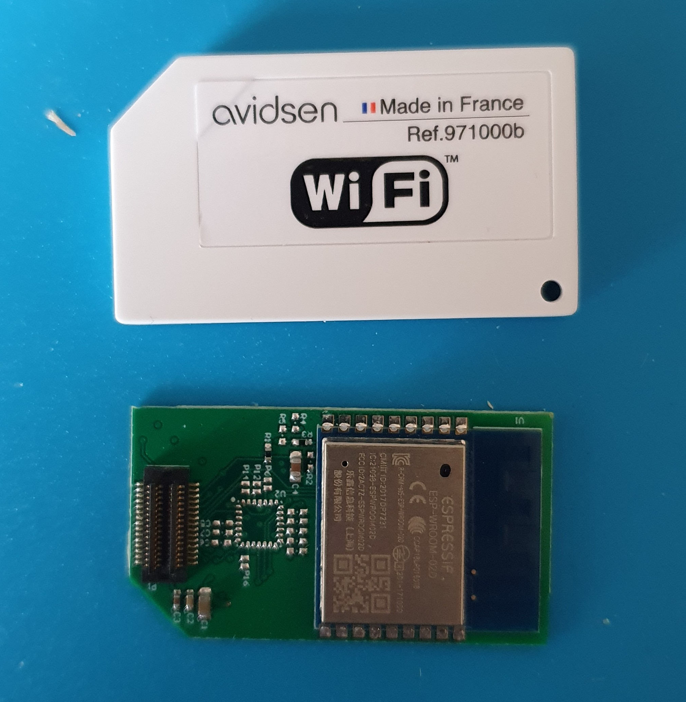

# Free your Thomson Guardian switch with ESPHome
Or *How to update your Thomson Guardian gate controller switch with an extremely simple ESPHome firmware.*
_____________________________________


_____________________________________

When I installed my gate there was a free Thomson Guardian device along with the gate motor I acquired. It stayed in its box for quite some time until I discovered ESPHome while working on another project [here](https://github.com/ludrao/shutterswitch).

I first tried the device with the official tools and software, it worked ok, I was able to control it with my phone after creating an account on the *Thomson At Home* cloud etc. There was 1-2 seconds lags though and I did not find the UI that great. But anyway and in any case I would not settle with this solution: I wanted to control it with my local server using Home Assistant, and most likely/ideally with ESPHome.

So I cracked open the device, no screws, just carefully unclip the grey top lid. You then see a white module that is simply clipped, so you can gently pull it out as well. It looks like a giant SIM card.

This white module can in turns be opened (again just plastic clips, no screws), and the Wi-Fi module PCB be exposed. Oh marvelous is uses an ESP-WROOM-02 module. This module is based on the famous ESP-8266 chip that is well supported by ESPHome, out of the box.




**Note:** Most (all?) of the Thomson home automation hardware and solution seems to be outsourced to [Avidsen](https://www.avidsen.com/). The Wi-Fi module seems to be based on their [@mod solution](https://www.lesnumeriques.com/objet-connecte/avidsen-presente-sa-solution-connectee-mod-n61857.html) (Sorry only content I found was in French...). This initiative does not seem to have picked up since we cannot find much information on this topic... (or products to buy)

## Back to the hack

I remove the rest of the plastic case to uncover the Power Domain PCB and hoped to understand more on what was the communication channel between the Wi-Fi module and the Power PCB. The Power PCB did not seem to contain any IC, except for the Power supply.

Other than the power supply circuitry, the Power PCB has 2 relays, an LED and a push button.
The PCB seems to be multi layers and very small/packed component, high density connectors between the boards, I did not try to understand the overall schematics...

Back to the control board (Wi-Fi module), it has a high density connector and high density PCB traces, space for what could be a companion MCU etc...

To understand how it worked, I assumed that the relays, LED and button where directly wired to the ESP WROOM module. The module has a much easier access (large pads that are easy to solder on), and only a limited number of IOs.
Here is the ESP-WROOM-02 pinout:


I started to solder 3.3V (Pin 1) and GND (pin 9), and I powered the module only (i.e. detached from the Power PCB), and waited to see if it would show up in my *Thomson At Home* Application. And, good news, it connected alright!

I then soldered wires on RX/TX pins (pin 11 and 12), and connected my USB to serial 3.3 TTL dongle. I was able see output using the standard 19200 (8n1) baud speed settings (but nothing really interesting or that I actually needed).

Before going further I wanted to backup the original proprietary firmware just in case.

To be able to backup the flash you need to put the device into UART boot mode, to do this simply pull down GPIO0 (or directly connect to GND, but I used a 0.5K resistor, just in case...).
Some info that might [help](https://lanrat.com/programming-bare-esp-wroom-02/).
I then installed esptool (`pip install esptool`) and read the flash.

```
esptool.py read_flash 0x00000 0x200000 backup.img
```
That worked for me. But there are options to help if this does not work out of the box for you, please look [there](https://steve.fi/hardware/backup-and-restore/) for instance.

## What are the pins?

I then used a scope to see if there was any signal on one of the ESP module pins while I pressed the different "Open Gate" buttons on the *Thomson At Home* app.

**Danger:** Do not do this while the module is connected on main power supply. I only powered the Wi-Fi module using 3.3V pin.

Here is what I found:
* Pin 3 (GPIO14) is controlling the Relay 1
* Pin 4 (GPIO12) is controlling the Relay 2
* Pin 5 (GPIO13) is activated by the Push Button on the main power PCB
* Pin 8 (GPIO0) is connected to the Status LED on the main Power PCB

**Note:**
* to figure out the LED pin I had noticed that the LED blinked when powering up the device. So I checked for a slow oscillating high/low signal at power up.
* I actually figured the Push Button later on (chronologically): once I had ESPHome installed on the module, I assembled back the device and created a temporary firmware that would log state change on all unused IO of the module. I connected OTA to the module so there was no risk of touching the device while powered by the main power (240V)


## Final touch
To implement the gate control firmware I used this [yaml file](guardian.yaml). It uses the latest version (2021.12) that provide "Button" integration with Home Assistant.

**Note:** you need to create a `secrets.yaml` file at the same level, it shall contain all the secrets used by the firmware, something like:
```yaml
# OTA and API passwords
hass_api_key: "XXXXXXX"
ota_key: "YYYYYY"

# Wi-Fi settings
wifi_ssid: "SOME SSID"
wifi_password: "WIFI PASSWORD"
```

The Guardian module provides two relays that can be activated independently. My gate motor has two inputs each one open the gate either for about 1 meter (pedestrian passage) or full opening (car passage). The inputs really behave as with the remote control button so a "press" open the gate, another "press" stop it (or close it depending on how you configured the gate motor).

The device firmware is setup to send a 'high' level (i.e. close the relay) for 0.5 seconds on each 'press' action.

Once the device connects and that you type the API password in HA you should see something like this:


Do not hesitate to send feedback! (Through GitHub issues, Pull Request, ideas, ...)